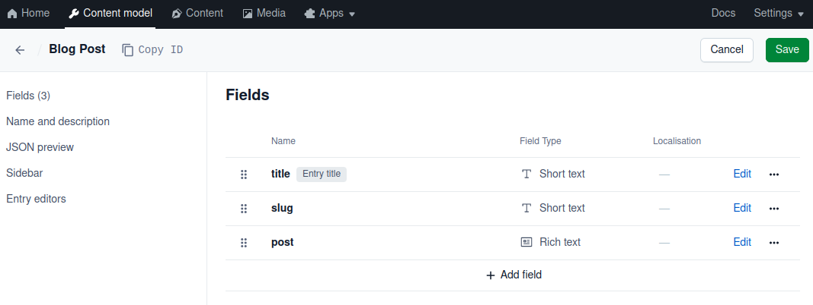

# 🐦 How to Write Contentful Migrations

## For Starters

Contentful migrations are very similar to Database migrations. And the power of scripting migrations is that the Contentful
Content-types (equivalent to Database tables) can have a unique structure that fits the current needs of the Editors and
Developers. 

Some of the best resources to start writing migrations are:
* [Scripting migrations with the Contentful CLI](https://www.contentful.com/developers/docs/tutorials/cli/scripting-migrations/)
* [The right way to migrate your content...](https://www.contentful.com/blog/using-the-contentful-migration-cli/)
* [Contentful migration official README](https://github.com/contentful/contentful-migration/blob/master/README.md)

However, as the official Migration CLI (and NPM library) takes care of so many things, it is left to the user/developer
to implement a suitable strategy to make migrations reliable and make the different environments work in a reliable way.

## Use environments as branches

One of the first things to do is to think, for all intents and purposes, of Contentful Environments as Git Branches. 
The idea behind is that we can create a new 'Environment' from an existing one (let's say 'dev'), create then a migration
and test it properly. When everything is set, this migration can be committed alongside with the code, and be executed 
on the 'dev' Environment assuring that the Content-types are correctly migrated and no data is corrupted during that process. 

Similarly, we could use the scripted migration in a CI/CD pipeline, to automatically apply the same migrations to a 'staging' 
or 'master' Environment whenever the code is deployed from their respective branches.

### Use a '-dev' and '-test' environment

But one of the first things to do is to actually create and/or modify existing Content-types to see if they fit whatever 
FE Development is intended for them. And meanwhile it is true that a simple migration can be scripted right away, it is
always better to start with a new Environment to make these modifications, till we are satisfied with them.

A suggestion is to create a new Environment, using the migration number, or the ticket ID from JIRA, or anything else
really that can make the Environment name unique. Let's assume we arrived at migration '26' and we want to work on a new
set of modifications, we could call the Environment (duplicated from 'dev' or 'master') `0027-dev`. In this branch we
could manually change, add, and remove Content-types till we are satisfied with the final result.

Let's open the Contentful Web App (https://app.contentful.com/) and go to the tab 'Content model'. Once there click 
on the blue button '+ Add content type'. We are going add a fictitious 'Blog Post' Content-type, just to show a relatable
example. We then proceed to add some fields:

* `title` / short text - Select the field as 'Entry title' and 'Required Field'.
* `slug` / short text - Configure it as 'Required' and 'Unique' - Towards the end select 'Appearance > Slug'.
* `post` / rich text - Just use default settings and click 'Confirm'.

Remember to click on 'Save' in the top right corner. You should see in your editor something like this:


But how do you transform a manual edit into a Contentful migration? This is mostly thanks to the 'JSON preview'. The 
resulting JSON structure can be easily ported to the Javascript syntax of the migration. Let's see how the JSON looks 
like:

<details>
    <summary><code>JSON object of the new Content-type</code></summary>

```json
{
  "name": "Blog Post",
  "description": "New Amazing Blog articles",
  "displayField": "title",
  "fields": [
    {
      "id": "title",
      "name": "title",
      "type": "Symbol",
      "localized": false,
      "required": true,
      "validations": [],
      "disabled": false,
      "omitted": false
    },
    {
      "id": "slug",
      "name": "slug",
      "type": "Symbol",
      "localized": false,
      "required": true,
      "validations": [
        {
          "unique": true
        }
      ],
      "disabled": false,
      "omitted": false
    },
    {
      "id": "post",
      "name": "post",
      "type": "RichText",
      "localized": false,
      "required": false,
      "validations": [
        {
          "enabledMarks": [
            "bold",
            "italic",
            "underline",
            "code",
            "superscript",
            "subscript"
          ],
          "message": "Only bold, italic, underline, code, superscript, and subscript marks are allowed"
        },
        {
          "enabledNodeTypes": [
            "heading-1",
            "heading-2",
            "heading-3",
            "heading-4",
            "heading-5",
            "heading-6",
            "ordered-list",
            "unordered-list",
            "hr",
            "blockquote",
            "embedded-entry-block",
            "embedded-asset-block",
            "table",
            "hyperlink",
            "entry-hyperlink",
            "asset-hyperlink",
            "embedded-entry-inline"
          ],
          "message": "Only heading 1, heading 2, heading 3, heading 4, heading 5, heading 6, ordered list, unordered list, horizontal rule, quote, block entry, asset, table, link to Url, link to entry, link to asset, and inline entry nodes are allowed"
        },
        {
          "nodes": {}
        }
      ],
      "disabled": false,
      "omitted": false
    }
  ],
  "sys": {
    "space": { ... },
    "id": "blogPost",
    "type": "ContentType",
    "createdAt": "2023-08-13T13:49:46.647Z",
    "updatedAt": "2023-08-13T13:49:47.052Z",
    "environment": { ... },
    "publishedVersion": 1,
    "publishedAt": "2023-08-13T13:49:47.052Z",
    "firstPublishedAt": "2023-08-13T13:49:47.052Z",
    "createdBy": { ... },
    "updatedBy": { ... },
    "publishedCounter": 1,
    "version": 2,
    "publishedBy": { ... }
  }
}
```
</details>

As we can see when we will start scripting the migration, the field names, values and structure is very similar to what
needs to be defined with the Javascript syntax. Let's first add the content-type data and the basic migration structure:

<details>
    <summary><code>0027-Add-BlogPost.cjs</code></summary>

```js
const {default: Migration, MigrationContext } = import("contentful-migration")

/**
 * @param {Migration} migration
 * @param {MigrationContext} context
 * @returns {Promise<void>}
 */
module.exports = async function (migration, context) {
    const blogPost = migration.createContentType('blogPost', {
        name: 'Blog Post',
        description: 'New Amazing Blog articles',
        displayField: 'title'
    })

    blogPost.createField('title')
        .name('title')
        .type('Symbol')
        .localized(false)
        .required(true)
        .validations([])
        .disabled(false)
        .omitted(false)

    blogPost.createField('slug')
        .name('slug')
        .type('Symbol')
        .localized(false)
        .required(true)
        .validations([
            {
                "unique": true
            }
        ])
        .disabled(false)
        .omitted(false)

    blogPost.createField('post')
        .name('post')
        .type('RichText')
        .localized(false)
        .required(false)
        .validations([
            {
                "enabledMarks": [
                    "bold",
                    "italic",
                    "underline",
                    "code",
                    "superscript",
                    "subscript"
                ],
                "message": "Only bold, italic, underline, code, superscript, and subscript marks are allowed"
            },
            {
                "enabledNodeTypes": [
                    "heading-1",
                    "heading-2",
                    "heading-3",
                    "heading-4",
                    "heading-5",
                    "heading-6",
                    "ordered-list",
                    "unordered-list",
                    "hr",
                    "blockquote",
                    "embedded-entry-block",
                    "embedded-asset-block",
                    "table",
                    "hyperlink",
                    "entry-hyperlink",
                    "asset-hyperlink",
                    "embedded-entry-inline"
                ],
                "message": "Only heading 1, heading 2, heading 3, heading 4, heading 5, heading 6, ordered list, unordered list, horizontal rule, quote, block entry, asset, table, link to Url, link to entry, link to asset, and inline entry nodes are allowed"
            },
            {
                "nodes": {}
            }
        ])
        .disabled(false)
        .omitted(false)


    blogPost.changeFieldControl('slug', 'builtin', 'slugEditor', {
        trackingFieldId: 'title'
    })
}
```
</details>

Now we have our migration, but we don't know if it works correctly or will perform the expected modifications. Meanwhile
linters can help with the syntax and general validity of the Javascript code, it's always good to test the migration 
itself in a new 'clean' Environment, so that we can be sure the automation during deployment will go without problems.
To do that, let's duplicate a new Environment from the original source Environment. Just create a duplicate of `dev` and
call it `0027-test`. This also allows us to tune the Content-type in the other `0027-dev` Environment, and adjust the
migration till we are satisfied (we can always delete and recreate the `0027-test` Environment, since its sole purpose
is to validate the migration runs smoothly).

Save the file `0027-Add-Blog-Post.cjs` under the folder `./migrations/scripts` of your project and then run:

```shell
$ npx contentful-cli-migrations --to 0027-test
```

You should see the following output:

```shell
##/INFO: Applying migrations to environment-id: 0027-test
##/INFO: Latest migration successfully run # 26
The following migration has been planned

Environment: 0027-test

Create Content Type blogPost
  - name: "Blog Post"
  - description: "New Amazing Blog articles"
  - displayField: "title"

  Create field title
    - name: "title"
    - type: "Symbol"
    - localized: false
    - required: true
    - validations: []
    - disabled: false
    - omitted: false

  Create field slug
    - name: "slug"
    - type: "Symbol"
    - localized: false
    - required: true
    - validations: [{"unique":true}]
    - disabled: false
    - omitted: false

  Create field post
    - name: "post"
    - type: "RichText"
    - localized: false
    - required: false
    - validations: [{"enabledMarks":["bold","italic","underline","code","superscript","subscript"],"message":"Only bold, italic, underline, code, superscript, and subscript marks are allowed"},{"enabledNodeTypes":["heading-1","heading-2","heading-3","heading-4","heading-5","heading-6","ordered-list","unordered-list","hr","blockquote","embedded-entry-block","embedded-asset-block","table","hyperlink","entry-hyperlink","asset-hyperlink","embedded-entry-inline"],"message":"Only heading 1, heading 2, heading 3, heading 4, heading 5, heading 6, ordered list, unordered list, horizontal rule, quote, block entry, asset, table, link to Url, link to entry, link to asset, and inline entry nodes are allowed"},{"nodes":{}}]
    - disabled: false
    - omitted: false

Publish Content Type blogPost
Update field controls for Content Type blogPost

  Update field slug
    - widgetId: "slugEditor"
    - widgetNamespace: "builtin"
    - trackingFieldId: "title"
? Do you want to apply the migration (Y/n) 
```

By pressing the `Y` to confirm, we can see the migration being applied:

```shell
✔ Create Content Type blogPost
✔ Update field controls for Content Type blogPost
🎉  Migration successful
##/INFO: Migration 0027-Add-Blog-Post.cjs Done!
```

The migration is now safe to be committed alongside other code of your work. Once the commit is pushed, you can safely
remove both the `0027-dev` and `0027-test` Environments from Contentful.

## async/await

A thing you might have noticed in the migration script example, is that the function is defined as `async`.

```javascript
const {default: Migration, MigrationContext } = import("contentful-migration")

/**
 * @param {Migration} migration
 * @param {MigrationContext} context
 * @returns {Promise<void>}
 */
module.exports = async function (migration, context) {
    ...
}
```

For most of the use cases you might see migrations with or without async, however it's a good practice to define the 
function as `async` when using this tool, since the call to the scripts are all performed using `await`. In addition,
using `async` allows to include other functions, and be sure that everything is executed in the correct order.

If you are still not convinced, you can read this article on 
[5 Reasons Why Javascript async/await wins over promises](https://dev.to/deadwin19/5-reasons-why-javascript-async-await-over-promises-1if3).

Another best practice is to add annotations to your migrations. In this way you will most likely unlock your 
editor capabilities to help you autocomplete the different functions (like `createContentType`, `editContentType`, and 
so on). If by chance your editor still doesn't want to show you any suggestion for the functions, you could separately 
add the `contentful-migration` npm package in your package.json (it worked on IntelliJ editor).

## transformEntries

Even though is documented, a 'function' of Contentful Migrations that is often overlooked is `transformEntries`. The 
reason to say such a thing, is because this function is pretty powerful and not only can help to transform a text field
to a reference field (as many examples show with 'Blog Post Author' example), but it unlocks the possibility to 
manipulate data, till a certain degree, in a migration that is usually/mostly supposed to change the structure.

Let's take a real case: you want to change the validation for a certain 'id' field, like the slug of the previously 
created blog post (that has no validation on the input characters), or a product id. Changing the validation might be 
needed to avoid that the Editors will input some weird characters that could create problems down the line. For example, 
a slug, that is used to build a link, can result in a malformed URI.

In this case we should use a migration to first change the existing data, and then change the validation, so that we 
won't have problem when applying that migration (it could fail if the old data is considered invalid). Changing 
the existing data will also ensure that if we modify an older entry, we will not be blocked by the invalid id (or slug) 
to republish the updated entry.

<details>
    <summary><code>0043-Add-Validation-to-Slug-in-BlogPost.cjs</code></summary>

```js
const {default: Migration, MigrationContext } = import("contentful-migration")

/**
 * @param {Migration} migration
 * @param {MigrationContext} context
 * @returns {Promise<void>}
 */
module.exports = async function (migration, context) {
    migration.transformEntries({
        contentType: 'blogPost',
        from: ['slug'],
        to: ['slug'],
        // This loops in the field slug for each locale that might be present
        transformEntryForLocale: function (fromFields, currentLocale) {
            // We want to be sure a value is set up for the slug
            if (
                fromFields !== undefined &&
                fromFields['slug'] !== undefined &&
                fromFields['slug'][currentLocale] !== undefined
            ) {
                // Initial values
                let originalSlug = fromFields['slug'][currentLocale]
                let cleanedSlug = ''

                // It removes anything that is not lowercase letter, numbers and dashes
                cleanedSlug = originalSlug.toLowerCase().replace(/[^a-z0-9-]+/, '')
                
                // We assign the cleaned up slug back to the field
                return {
                    slug: cleanedSlug
                }
            }
        }
    })

    const blogPost = migration.editContentType('blogPost')

    blogPost.editField('slug').validations([
        {
            // We maintain the unique 'true'
            unique: true
        },
        {
            // We add the regular expression for valid characters
            regexp: {
                pattern: '^[a-z0-9\\-]*$',
                flags: 'g'
            },
            message:
                'The ID only allows: lowercase letters, numbers and dashes'
        }
    ])
}
```
</details>

As any powerful functionality, it surely should be used with responsibility, and it should be tested extensively, the 
more important is the data for your business (that's why using also the 
[Contentful CLI Export](https://www.npmjs.com/package/contentful-cli-export) to make backups is always a good idea).

In addition, using the `transformEntries` with the two other 'tricks' we are going to explain (makeRequest and Locales), 
represents a somehow practical, repeatable and even cheaper alternative to writing your own script everytime some strong
data manipulation is needed.

## makeRequest

Another feature that is documented but is also very powerful and obscure is the 'context' that is usually passed
when creating a migration:

```js
module.exports = async function (migration, context) {
    ...
}
```

`context` contains 3 important object, and per documentation the module.exports can be written like this:

```js
module.exports = async function (migration, { makeRequest, spaceId, accessToken }) {
    ...
}
```

Meanwhile `spaceId` and `accessToken` are quite easy to understand, respectively the spaceId on which we are performing
the migration (useful if you want to specify a slightly different behaviour for that space), and accessToken is the 
management accessToken that is executing the migration (We will see later how that can be used).

But it's the first `makeRequest` object that is the most interesting one. `makeRequest` allows you to perform 
Contentful Management API Calls inside the migration. 

> Remember: With great power comes great responsibility! 🕷️

Let's see an example of a makeRequest inside a migration:

```js
const {default: Migration, MigrationContext } = import("contentful-migration")

/**
 * @param {Migration} migration
 * @param {MigrationContext} context
 * @returns {Promise<void>}
 */
module.exports = async function (migration, { makeRequest, spaceId, accessToken }) {
    await migration.transformEntries({
        contentType: 'blogPost',
        from: ['authour'],
        to: ['authorName'],
        transformEntryForLocale: async function (fromFields, currentLocale) {

            ...

            const refEntryId = fromFields?.author['en-US']?.sys?.id

            if (refEntryId !== undefined) {
                const refEntry = await makeRequest({
                    method: 'GET',
                    url: `/entries/${refEntryId}`
                })
            }

            ...

        }
    })
}
```

In this case, we would take a referenced Entry object, from its sys.id, and we would use that for some manipulation.
In this example, it would work well inside `transformEntries`, for example to take read the referenced entry and extract 
the first and last name of the author. 

But the `makeRequest` doesn't stop there. It allows you to perform also editing or deleting Entries, and that can be 
very dangerous. And it is somehow different from what we have seen before, for two reasons:

1. Differently from the `transformEntries`, the request is a raw API call, hence it's not structured inside a method that
   would work inside the framework. It does not have built-in fail over, error management or even basic checks.
2. The API calls are performed **before** the migration runs. Especially if editing some data, this means that if we 
   abort the migration (or it fails), the modified data will still remain modified. So when editing or adding values,
   we should always use some sort of idempotent action (like adding the full name to a new field from first or last name).

See in details `{ makeRequest }` on the official documentation: 
https://github.com/contentful/contentful-migration/blob/master/README.md#context

If you want to see the makeRequest in action, try this:

<details>
    <summary><code>0044-Test-makeRequest.cjs</code></summary>

```js
const {default: Migration, MigrationContext } = import("contentful-migration")

/**
 * @param {Migration} migration
 * @param {MigrationContext} context
 * @returns {Promise<void>}
 */
module.exports = async function (migration, { makeRequest, spaceId, accessToken }) {
    const entryId = 'your-entry-id'
    const result = await makeRequest({
        method: 'GET',
        url: `/entries/${entryId}`
    })

    console.log(result)
}
```

</details>

## Locale-agnostic migrations

Let's now kind of summarize all we explained so far, by addressing a problem that can happen when the scope of your 
business expands. Writing Contentful migrations is all fun and cool, and writing them with a structured tool, makes you
sleep good at night. However, as your business expands there might be the need to duplicate all the work you have
done into another space, to support an expansion: the classic example is when your website/e-commerce expands in new
countries.

As developers, we want to continue writing migrations that can accommodate as many scenarios as possible. Nobody 
is forbidding you to have one set of migrations for space-id: 1 and one for space-id: 2. But in a business, especially
when the only difference is about language and locale, be able to write a migration that is locale-agnostic could be
for you a life (and money) saver.

The idea of locale-agnostic is that locale is only used in Contentful migrations when setting default values or when
transforming entries per locale. So with few simple functions you would be able to write migrations whose parameters 
are not baked in the script, hence be able to run the same migration on two different spaces. One tht has en-US as 
default locale, and 2 additional locales; but also one that has it-IT as default one, and maybe 5 more locales.

This doesn't come out of the box, but it can be implemented with all the tools we have seen so far, included the 
[Contentful Lib Helpers Library](https://www.npmjs.com/package/contentful-lib-helpers) on top of which many of these 
scripts are built.

For this you will need to include in your migration script:
* The Contentful Management library (that is already imported)
* The Contentful Migration library, for the annotations
* The Contentful Lib Helpers

The Helpers provide you with some simple functions for locale:
* `getAllLocalesCode` - Returns the array of locale codes. ie: ['en-US', 'it-IT', 'de-DE'], where usually the first one
  is the default one;
* `getDefaultLocaleCode` - The default locale code as a string. ie: 'en-US';
* `getDefaultValuesForLocales` - It builds an object with all the locale codes as keys, and the passed default value as 
  the value for each of the objects.

Let's see an example migration that uses the `getDefaultLocaleCode` function, and then using the returned value as the 
key for the default value in a new field(in this case `en-US`). As you can see we use the 'context' object to extrapolate 
also the environmentId (in addition to spaceId and accessToken), and all the imports and await calls are in a separate, more 
readable and easy to use external function.

<details>
    <summary><code>0045-Add-isPromoted-to-BlogPost.cjs</code></summary>

```js
const {default: Migration, MigrationContext } = import("contentful-migration")

/**
 * @param {Migration} migration
 * @param {MigrationContext} context
 * @returns {Promise<void>}
 */
module.exports = async function (migration, { spaceId, environmentId, accessToken }) {
   const blogPost = migration.editContentType(
           'blogPost'
   )

   const defaultLocale = await getDefaultLocale(spaceId, environmentId, accessToken)

   blogPost
           .createField('isPromoted')
           .name('Is the post promoted?')
           .type('Boolean')
           .required(true)
           .localized(false)
           .disabled(false)
           .omitted(false)
           .validations([])
           .defaultValue({
              [defaultLocale]: false
           })
}

async function getDefaultLocale(spaceId, environmentId, accessToken) {
   const ctManagement = await import('contentful-management')
   const contentfulManagement = ctManagement?.default === undefined ? ctManagement : ctManagement?.default

   const fnGetEnvironment =
           await import('contentful-lib-helpers/lib/getEnvironment.js')
   const environment = await fnGetEnvironment.getEnvironment(
           contentfulManagement,
           accessToken,
           spaceId,
           environmentId
   )

   const fnGetDefaultLocaleCode =
           await import('contentful-lib-helpers/lib/locales/getDefaultLocaleCode.js')

   return await fnGetDefaultLocaleCode.getDefaultLocaleCode(environment)
}
```
</details>
